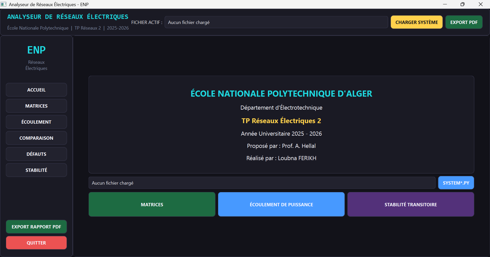
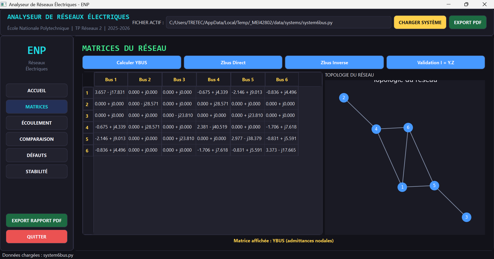
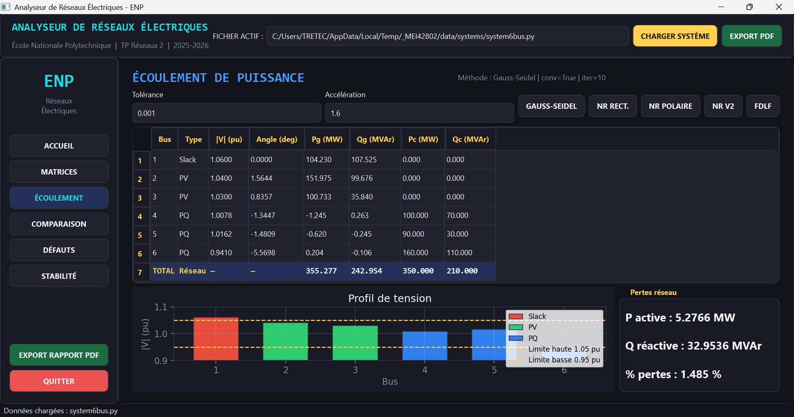
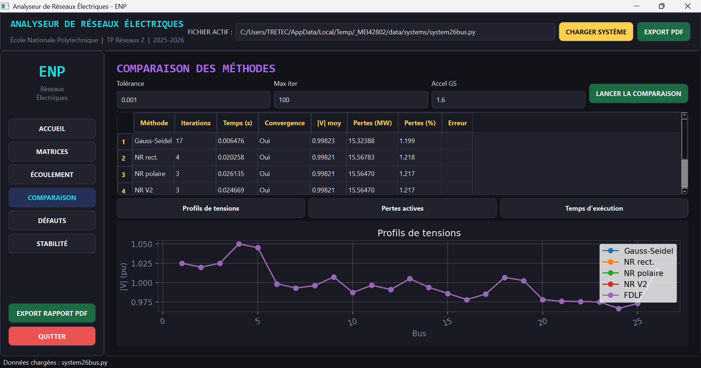
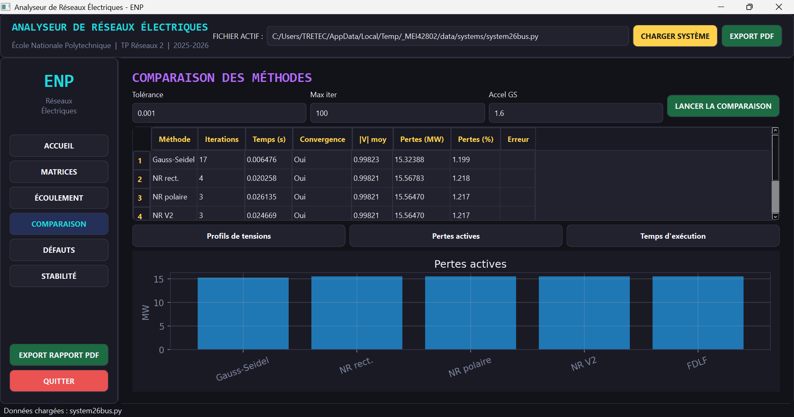
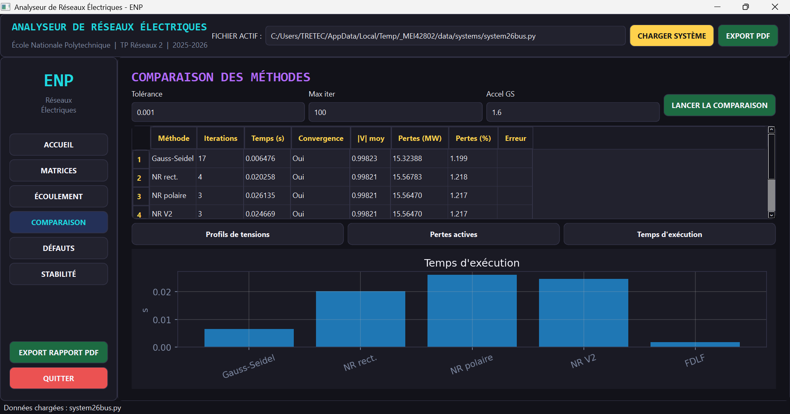
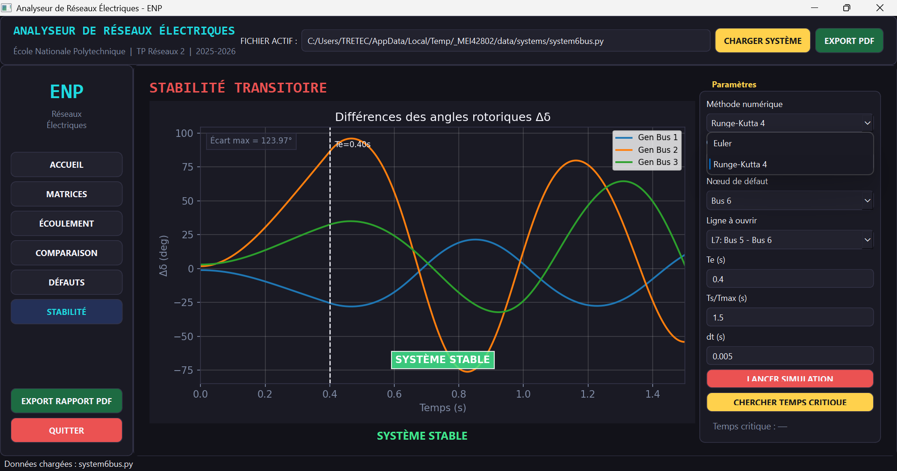

# PowerFlow Python Analyzer

A Python desktop application for electrical power-system analysis, including network matrix construction, load-flow computation, method comparison, fault analysis, transient stability simulation, and PDF report generation.

---

## Overview

**PowerFlow Python Analyzer** is an engineering-oriented desktop application designed to analyze electrical power networks through a graphical user interface.

The application allows users to load predefined power-system test cases, compute the main network matrices, solve the load-flow problem using several numerical methods, compare their performance, analyze fault conditions, study transient stability, and export simulation results into a PDF report.

The project was developed in Python with a modular architecture, separating numerical computation, data handling, graphical interface, formatting utilities, and testing.

---

## Key Features

### Network Matrix Calculation

The application computes the main matrices used in power-system studies:

* `Ybus` nodal admittance matrix
* `Zbus` nodal impedance matrix
* Direct `Zbus` construction
* `Zbus` calculation from `Ybus` inversion
* Numerical validation of:

```text
Ybus × Zbus ≈ I
```

The matrix calculation module supports power networks with transmission lines, shunt elements, and transformer tap ratios.

---

### Load-Flow Analysis

The application implements multiple load-flow methods to determine the steady-state operating point of an electrical network.

Implemented methods:

* Gauss-Seidel
* Newton-Raphson rectangular formulation
* Newton-Raphson polar formulation
* Second Newton-Raphson formulation
* Fast Decoupled Load Flow, FDLF

Computed results include:

* Bus voltage magnitudes
* Bus voltage angles
* Active and reactive generated powers
* Active and reactive consumed powers
* Active and reactive network losses
* Number of iterations
* Execution time
* Convergence status

---

### Method Comparison

The comparison module evaluates the performance of the implemented load-flow methods.

The comparison is based on:

* Voltage profiles
* Active power losses
* Reactive power losses
* Number of iterations
* Execution time
* Convergence behavior

This module helps identify the most suitable method depending on network size, required accuracy, and computational efficiency.

---

### Fault Analysis

The application includes a fault-analysis module for studying short-circuit conditions in electrical networks.

Supported fault types:

* Three-phase fault
* Line-to-ground fault
* Line-to-line fault
* Double-line-to-ground fault

The module computes fault-related quantities such as fault current, phase voltages, sequence components, and short-circuit power.

---

### Transient Stability Analysis

The transient stability module studies the dynamic behavior of generators after a disturbance.

The simulated scenario is based on a fault event followed by fault clearing after a selected clearing time.

The module computes and displays:

* Rotor angle evolution
* Angular speed evolution
* Stable operating cases
* Marginal stability cases
* Unstable cases
* Critical clearing time estimation

Numerical integration methods:

* Euler predictor-corrector method
* Fourth-order Runge-Kutta method

---

### PDF Report Export

The application can generate a PDF report containing the main simulation results, including:

* Selected system information
* Matrix calculation results
* Load-flow results
* Fault-analysis results
* Stability results
* Method comparison results

---

## Graphical User Interface

The desktop interface is built with **PySide6**.

Main GUI modules:

* Home page
* Network loading section
* Matrix calculation page
* Load-flow analysis page
* Method comparison page
* Fault-analysis page
* Transient stability page
* PDF export functionality

The interface provides result tables, plots, indicators, and topology visualization to make power-system analysis easier and more interactive.

---


### Home Interface



### Matrix Calculation



### Load-Flow Results



### Comparison Page – Voltage Profile

This view compares the voltage magnitudes obtained with the different load-flow methods for all buses in the selected network.



### Comparison Page – Active Power Losses

This view compares the total active power losses computed by each load-flow method.



### Comparison Page – Execution Time

This view compares the execution time of each method and highlights their computational efficiency.



### Transient Stability



---

## Project Structure

```text
powerflow-python-analyzer/
│
├── main.py
├── README.md
├── requirements.txt
├── requirements-dev.txt
├── .gitignore
│
├── core/
│   ├── comparison.py
│   ├── fault_analysis.py
│   ├── fdlf.py
│   ├── gauss_seidel.py
│   ├── newton_raphson.py
│   ├── power_results.py
│   ├── power_system_data.py
│   ├── report_export.py
│   ├── stability.py
│   ├── ybus.py
│   └── zbus.py
│
├── data/
│   ├── loader.py
│   └── systems/
│       ├── registry.py
│       ├── system3bus.py
│       ├── system5bus.py
│       ├── system5buscours.py
│       ├── system6bus.py
│       ├── system9bus.py
│       ├── system10bus.py
│       ├── system11bus.py
│       ├── system14bus.py
│       ├── system26bus.py
│       ├── system30bus.py
│       ├── system47bus.py
│       ├── system57bus.py
│       ├── system68bus.py
│       └── system118bus.py
│
├── ui/
│   ├── main_window.py
│   └── styles.py
│
├── utils/
│   └── formatting.py
│
└── tests/
    ├── test_core_corrections.py
    └── test_fault_analysis.py
```

---

## Built-in Test Systems

The application includes several predefined electrical networks:

* 3-bus system
* 5-bus system
* 6-bus system
* 9-bus system
* 10-bus system
* 11-bus system
* 14-bus system
* 26-bus system
* 30-bus system
* 47-bus system
* 57-bus system
* 68-bus system
* 118-bus system

These systems are used to validate the implemented algorithms and evaluate their performance on networks of different sizes.

---

## Technologies Used

* Python
* PySide6
* NumPy
* SciPy
* Pandas
* Matplotlib
* NetworkX
* ReportLab
* Pytest

---

## Installation

### 1. Clone the Repository

```bash
git clone https://github.com/your-username/powerflow-python-analyzer.git
cd powerflow-python-analyzer
```

### 2. Create a Virtual Environment

```bash
python -m venv .venv
```

### 3. Activate the Virtual Environment

On Windows:

```bash
.venv\Scripts\activate
```

On Linux or macOS:

```bash
source .venv/bin/activate
```

### 4. Install Dependencies

```bash
pip install -r requirements.txt
```

---

## Running the Application

Start the desktop application with:

```bash
python main.py
```

---

## Running Tests

Install the development dependencies:

```bash
pip install -r requirements-dev.txt
```

Run the test suite:

```bash
pytest -q
```

---

## How to Use the Application

1. Launch the application using:

```bash
python main.py
```

2. Select a power-system test case from the available systems.

3. Choose the desired analysis module:

* Matrices
* Load flow
* Comparison
* Fault analysis
* Transient stability

4. Run the selected calculation.

5. Analyze the numerical results, plots, losses, convergence indicators, and stability curves.

6. Export the results as a PDF report if needed.

---

## Validation

The project includes unit tests to verify the correctness of the core numerical modules.

Validation examples include:

* Verification of `Ybus` construction
* Consistency between direct `Zbus` construction and `Ybus` inversion
* Verification of `Ybus × Zbus ≈ I`
* Fault-analysis validation for multiple fault types
* Execution of core numerical modules through automated tests

Run tests with:

```bash
pytest -q
```

---

## Engineering Scope

This project covers several fundamental concepts in electrical power engineering:

* Power-system modeling
* Bus admittance matrix construction
* Bus impedance matrix construction
* Load-flow analysis
* Gauss-Seidel method
* Newton-Raphson method
* Fast Decoupled Load Flow
* Fault analysis using sequence networks
* Swing-equation-based transient stability
* Numerical integration
* Engineering GUI development
* PDF report generation

---

## Limitations

The current version is intended for academic and engineering study purposes.

Possible limitations:

* Input systems must follow the expected Python data format.
* The transient stability model uses simplified generator dynamics.
* Detailed excitation systems, governors, and protection relays are not included.
* Very large networks may require further optimization for faster execution.

---

## Future Improvements

Possible future improvements include:

* Add automatic data validation before simulation
* Improve topology visualization
* Add more detailed generator models
* Include excitation and governor models
* Add protection relay modeling
* Add more benchmark systems
* Add continuous integration testing with GitHub Actions

---

## Academic Context

This project was developed as part of an electrical power networks practical work assignment.

The objective was to transform theoretical power-system analysis methods into a functional Python desktop application with a graphical interface and reusable numerical modules.

---

## Author

**Loubna Ferikh**
Electrical Engineering Department
École Nationale Polytechnique
Algeria

---

## License

This project is provided for academic and educational purposes.

Before public reuse or distribution, consider adding an open-source license such as MIT, Apache-2.0, or GPL-3.0.
